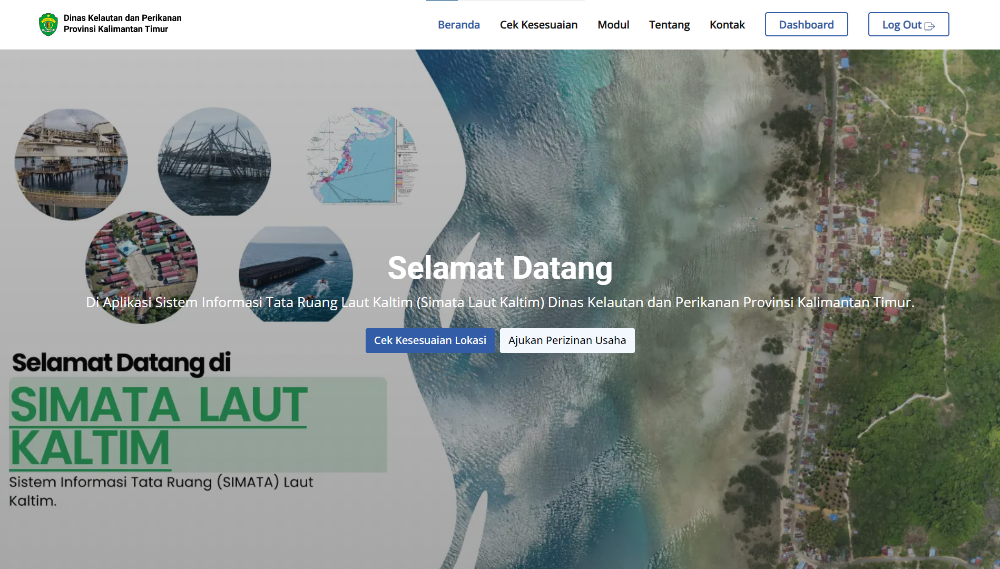
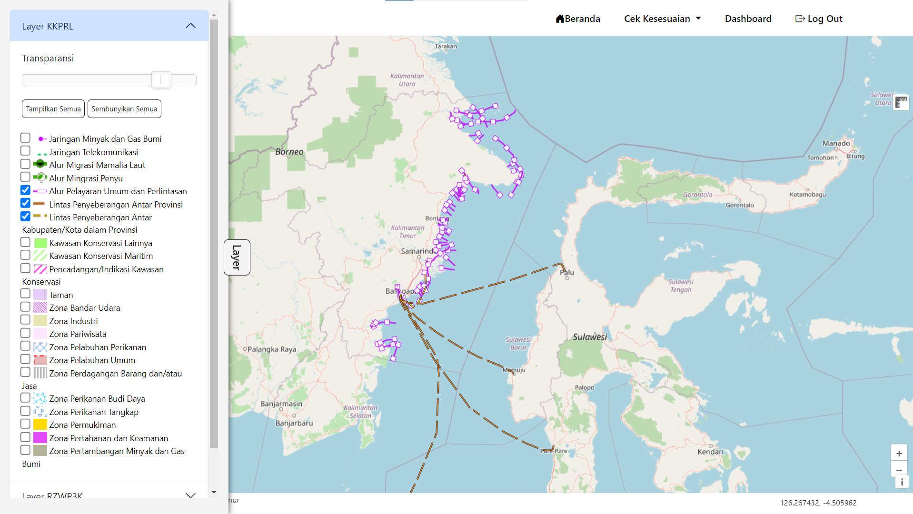
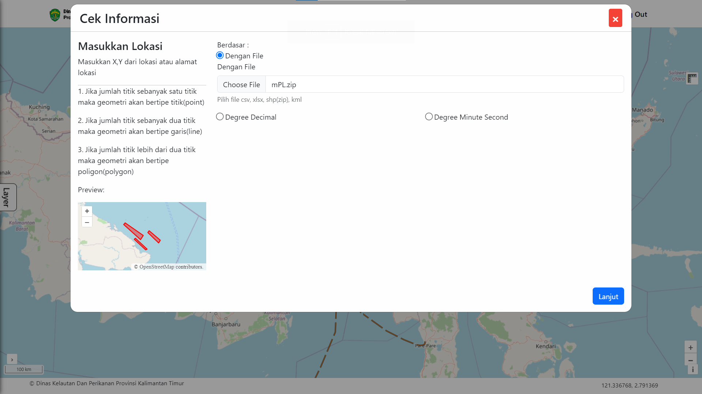
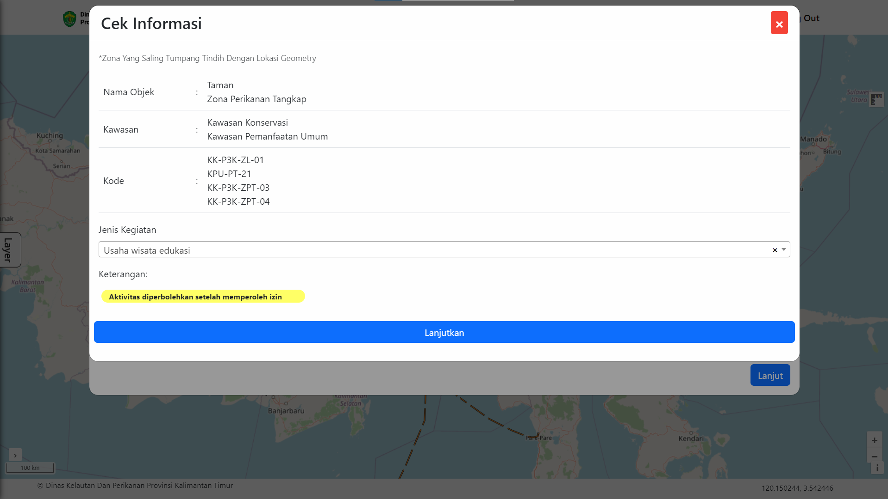
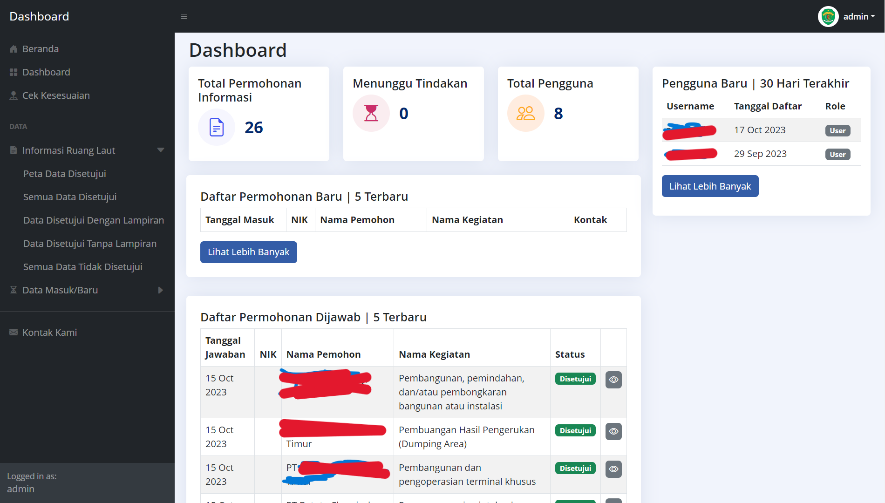
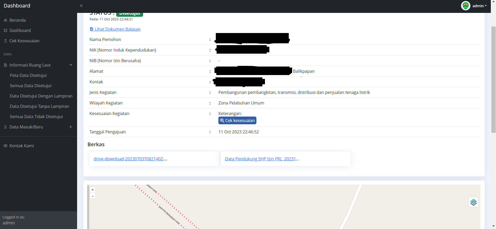

## Instalation

 You can view this installation <a href='https://drive.google.com/drive/folders/1-Xfz6QRZ6eaNZznxRdUOIuUbBB3jycED?usp=share_link' target=_blank><u>here</u>.</a>

 Get database backup <a href='https://drive.google.com/drive/folders/1QDUzMc-NgeWq0da_KRBgGze08m_9cTXC?usp=share_link' target=_blank><u>here</u>.</a>

## Screenshot

{ width=50% }
{ width=50% }
{ width=50% }
{ width=50% }
{ width=50% }
{ width=50% }

## Tech Stack

- Codeigniter 4
- Postgresql
- PostGIS
- Geoserver
- OpenLayer
- Turf.js
- HTML, CSS, JS
